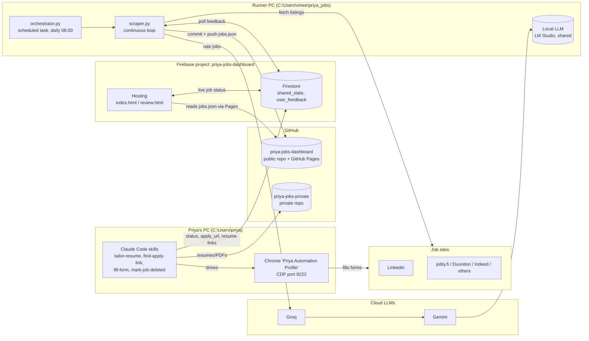
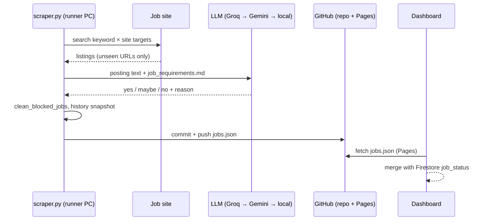
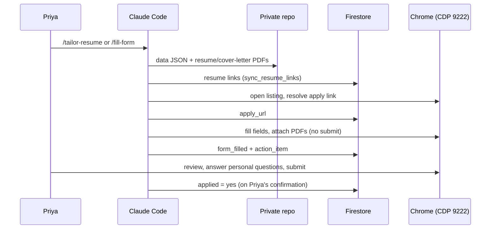

# priya_jobs — Architecture

Job-search automation for Priyanga Ramachandran. It finds job postings, rates each one against her
criteria with an LLM, shows them on a private web dashboard, and supports tailoring resumes and
pre-filling applications for the jobs she picks.

This document describes the system as of 2026-09-30. For operational gotchas and history, see
[memory.md](memory.md); for instructions to Claude Code sessions, see [CLAUDE.md](CLAUDE.md).

---

## 1. System context

| Piece | Where | Role |
|---|---|---|
| Public repo `priya-jobs-dashboard` | GitHub + `C:\Users\priya\priya_jobs` + runner PC clone | Scraper, tools, job data (`jobs.json`), dashboard source. Also served by GitHub Pages, which is where the dashboard reads the job list from. |
| Private repo `priya-jobs-private` | GitHub (account `vinchess1989`) + `C:\Users\priya\priya-jobs-private` | Master resume data, photo, and one folder per tailored job (data JSON, HTML, PDFs). Must sit next to the public repo; `find_repos.py` locates it by git remote. |
| Firebase project `priya-jobs-dashboard` | Google Cloud | Hosts the dashboard and holds Firestore (per-job status, dashboard feedback). |
| Runner PC | Vineeth's PC, `C:\Users\vinee\priya_jobs` | The only machine that runs the scraper on a schedule and pushes `jobs.json`. |
| Priya's PC | `C:\Users\priya` | Where resume tailoring and form filling happen, via Claude Code and a dedicated Chrome profile. |

---

## 2. Components

### 2.1 Scraper pipeline — `scraper.py`

A single self-contained program. `orchestrator.py` only does `git pull --rebase` and then runs it.

**Main loop** (default mode, runs until stopped):

1. **Poll the dashboard.** `poll_firebase_feedback()` reads `user_feedback` (approve/reject, applied,
   review-status changes) and applies them to `jobs.json`; approve/reject reasons are appended to
   `job_requirements.md` as auto-added positive/negative constraints. `poll_re_review_request()`
   handles a dashboard re-review request.
2. **Detect criteria changes.** `check_requirements_update()` hashes `job_requirements.md`; on any
   change it flags existing jobs `needs_re_review`.
3. **Review or scrape.** If jobs are pending review and a scrape isn't due, review a batch of 15
   (never-rated jobs before re-reviews). At least every `SCRAPE_INTERVAL_SECONDS` (1 hour) it scrapes
   up to 15 unseen jobs instead, then reviews them.
4. **Clean up.** `clean_blocked_jobs()` moves hard rejects to `deleted.json` (blocked title
   keywords, US-citizenship phrases, deadline passed by more than 2 days). It never removes jobs
   marked applied or user-reviewed.
5. **Record and publish.** `save_history_snapshot()` updates `jobs_history.json`; `update_git()`
   commits and pushes.

**Search targets.** `generate_targets()` crosses the keyword list `_KEYWORD_TERMS` (DevOps Engineer,
Configuration/Release/Quality/Requirements roles, Technical Writer, EU MDR, ISO 13485, Functional
Safety, Safety Critical, IEC 61508, ISO 26262, …) with `_KEYWORD_SITE_TEMPLATES` (LinkedIn Finland,
LinkedIn remote worldwide/EU, and other job boards). Progress through the target list is kept in
`checkpoint.json`; seen links in `seen_urls.json`. Each job's `id` is the first 8 hex characters of
the MD5 of its URL.

**LLM rating.** `_call_llm_with_fallback()` tries, in order: Groq (`GROQ_MODELS`), Gemini
(`GEMINI_MODELS`), then the local LLM (`LOCAL_LLM_ENDPOINT` / `LOCAL_LLM_MODEL`). The prompt is built
from `job_requirements.md`; the result is a verdict (`yes` / `maybe` / `no`), a reason, and the model
used. The local LLM is shared with the sibling projects `manju_jobs`, `vineeth_jobs` and
`priya_global_jobs`; OS-level file locks give priority manju > vineeth > priya > priya-global.

**Other modes:** `--scrape-only` (fetch, no rating), `--review-only`, `--review-urls URL…`,
`--git-only`, `--max-jobs N`.

### 2.2 Criteria — `job_requirements.md`

Plain-English rules the LLM applies: candidate profile, hard rejections (US-only, on-site outside
Finland, mandatory Finnish/Swedish, entry-level-only, …), target role types, location/work model,
experience level and language. Editing it changes future ratings and, via the hash check, queues
existing jobs for re-review.

### 2.3 Dashboard — `firebase_app/`

Static pages on Firebase Hosting (`priya-jobs-dashboard.web.app`), deployed with `firebase deploy`.

- `index.html` — main job board: filters, "Added" date column, mobile card view, applied/review
  controls, resume and cover-letter links.
- `review.html` — work queues (weak matches, action items, filled forms).
- **Auth:** Google sign-in, allow-listed emails only (`ALLOWED_EMAILS` in the page, enforced
  server-side by `firestore.rules`).
- **Data:** job list fetched from GitHub Pages (`vinchess1989.github.io/priya-jobs-dashboard/jobs.json`,
  plus `jobs_history.json` / `deleted.json`); live per-job status from the Firestore document
  `shared_state/job_status` (`onSnapshot`). User actions write both `shared_state/job_status` and a
  `user_feedback` record for the scraper to pick up.

### 2.4 Application workflow — Claude Code skills (`.claude/commands/`)

Run on Priya's PC, on request. They never submit an application or sign in on her behalf.

| Skill | What it does |
|---|---|
| `tailor-resume` | Writes `<id>_data.json` from `Resumes/Master/master_data.json` + the job description, renders it with `make_resume.py` → `html_to_pdf.py`, commits to the private repo, then runs `sync_resume_links.py`. |
| `find-apply-link` | Resolves a listing to the real application form or email, cheapest method first; uses and extends `site_patterns.json`; caches `apply_url` in Firestore. |
| `fill-form` | Discovery mode lists near-deadline unapplied jobs; per job it tailors the resume, finds the form, extracts fields (`scrape_application.py`), and fills them in the visible Chrome profile over CDP. Stops before submit; records `form_filled`. |
| `mark-job-deleted` | Sets `deletion_reason` for a job in Firestore. |

Supporting tools:

| File | Role |
|---|---|
| `make_resume.py` | Renders one-page A4 resume + cover letter HTML from a job data JSON (photo embedded; optional sections such as achievements and profile subsections render only when present). |
| `html_to_pdf.py` | Headless Chromium (Playwright) HTML → PDF. |
| `scrape_application.py` | Extracts form questions; generic mode attaches to the running Chrome on port 9222. |
| `sync_resume_links.py` / `upload_resume_links.py` | Scan private-repo job folders, write `input.csv`, push GitHub links for each resume/cover letter into Firestore. |
| `job_status_store.py` | CLI get/set of one field for one job URL in `shared_state/job_status`. |
| `firestore_auth.py` | Authorised session for all Python Firestore calls, using the service-account key. |
| `site_patterns.json` | Per-domain notes on how each job site's apply flow works (login gates, form selectors, quirks). |

---

## 3. Data model

### 3.1 Files (public repo)

| File | Written by | Contents |
|---|---|---|
| `jobs.json` | scraper (sole writer) | Array of job records — the dashboard's job list. |
| `deleted.json` | scraper | Hard-rejected / expired jobs, each with `deletion_reason`. |
| `jobs_history.json` | scraper | Daily counts for the dashboard's history chart. |
| `seen_urls.json`, `checkpoint.json` | scraper | Dedupe set; position in the target list. |
| `job_descriptions/*.txt` | scraper | Full posting text per job (`description_file`). |
| `input.csv` | `sync_resume_links.py` | Job id → resume / cover-letter links. |

**Job record** (main fields): `id`, `title`, `company`, `location`, `url`, `posted_date`, `deadline`,
`added_at`, `source`, `description_file`, `matches_requirements` (`yes`/`maybe`/`no`/`pending`/`error`),
`reason`, `eval_model`, `needs_re_review`, `applied`, `user_review`. Hand-added jobs use
`source: "manual_add"`, `eval_model: "manual"`.

### 3.2 Firestore

| Path | Contents |
|---|---|
| `shared_state/job_status` | One map keyed by job URL. Per job: `applied`, `apply_url`, `apply_email`, `form_filled`, `action_item`, `deletion_reason`, `matches_requirements`, `user_reason`, resume/cover-letter links. Read live by the dashboard; written by the dashboard and the Python tools. |
| `shared_state/re_review_request` | Re-review trigger from the dashboard. |
| `user_feedback/*` | Queue of dashboard actions (approve/reject with reason, applied, review status) for the scraper; marked `read` once processed. |

### 3.3 Private repo

`Resumes/Master/master_data.json` is the single source of truth for Priya's facts (experience,
tools, achievements, working-style text, references). Each job gets `Resumes/<job id>/` with
`<id>_data.json`, `<id>_checkpoint.json`, and `Priyanga_Ramachandran_resume|cover_letter.html|pdf`.
Jobs that were never scraped get made-up (synthetic) ids (e.g. `a17e0001`).

---

## 4. Key flows

**New job → dashboard**

**Chosen job → application**

**Dashboard feedback → criteria**

Approve/reject on the dashboard → `user_feedback` → `poll_firebase_feedback()` updates the job and
appends a constraint to `job_requirements.md` → hash changes → jobs re-queued for re-review.

---

## 5. Runtime, configuration and secrets

- **Python:** 3.12 venv per machine (`venv/`). Key packages: `playwright` (+ Chromium), `requests`,
  `beautifulsoup4`, `filelock`, `python-dotenv`, `google-auth`, `anthropic`.
- **Scheduling:** `setup_windows_scheduler.bat` registers task `PriyaJobsLocalLLMOrchestrator`
  (daily 08:00, runner PC). The scraper's own loop then keeps running.
- **Environment (`.env`, git-ignored):** `PRIYA_GROQ_API_KEY` (falls back to shared `GROQ_API_KEY`),
  `PRIYA_GEMINI_API_KEY`, `LOCAL_LLM_ENDPOINT`, `LOCAL_LLM_MODEL`, optional `LOCAL_LLM_API_KEY`,
  `GROQ_MODELS`, `GEMINI_MODELS`, and `GITHUB_TOKEN` for pushes.
- **Firestore credentials:** service-account key at `~/.secrets/priya-jobs-dashboard-sa.json` on every
  machine that runs the Python tools. Unauthenticated requests are rejected.
- **Browser automation:** Chrome started with
  `--remote-debugging-port=9222 --user-data-dir="%LOCALAPPDATA%\Google\Chrome\Priya Automation Profile"`.
  Priya signs in to job sites in this profile herself.

---

## 6. Security and privacy

- The public repo holds no personal documents; `.gitignore` blocks resumes, `.env`, and
  service-account keys. Resumes, photo and personal data live only in the private repo.
- Firestore rules allow reads/writes only for allow-listed Google accounts; Python tools use the
  service account (authorised by IAM, not by the rules).
- Automation never enters passwords, creates accounts, or clicks a final submit button.

---

## 7. Known risks and limitations

| Risk | Impact | Notes |
|---|---|---|
| `jobs.json` has a single writer | Hand-added jobs and edits from other machines can be overwritten. | `update_git()` rebases with `-X theirs` (scraper's copy wins conflicts), and a stale-copy run on 2026-09-23 erased the manual `de5e0002` entry. Re-check a hand-added job survives the next scraper push; don't run the scraper on two machines at once. |
| Criteria edits re-queue everything | Thousands of jobs re-rated; heavy LLM usage. | Scraping still runs hourly during the backlog; new jobs are rated first. |
| `deletion_reason` in Firestore is never read | Jobs flagged via `mark-job-deleted` stay on the board. | The skill documents a `poll_manual_deletions()` that `scraper.py` doesn't implement. |
| Employer portals behind logins | Forms can't be reached or filled automatically. | SuccessFactors (Wärtsilä, Nordea, Fortum) and Workday need Priya's own sign-in or account; Nordea's resume/cover-letter slots are shared across all applications. |
| `scrape_application.py` on Workday URLs | Crashes when no Workday credentials are set. | Use the CDP browser directly (see `site_patterns.json`). |
| Hard-coded runner paths | `orchestrator.py` and `setup_windows_scheduler.bat` point at `C:\Users\vinee\priya_jobs`. | Edit before running them on another machine. |
| LinkedIn rate limits | 429 responses after bursts of searches. | Each added keyword multiplies requests across sites. |

---

## 8. Related projects

`manju_jobs` and `vineeth_jobs` are sibling automations with the same design; they share the runner
PC's local LLM (and its priority locks) but have their own repos and Firebase projects.
`priya_global_jobs` is a separate board for jobs outside Finland; it skips URLs already in this repo's
`jobs.json`.
